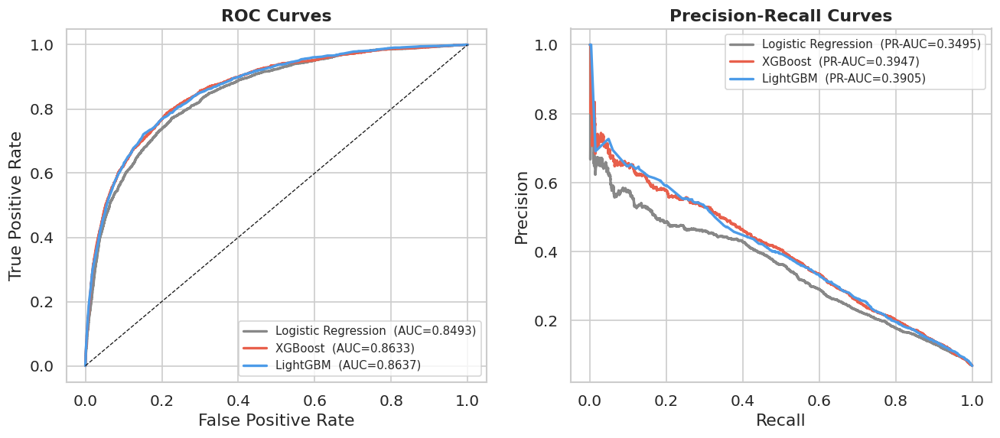
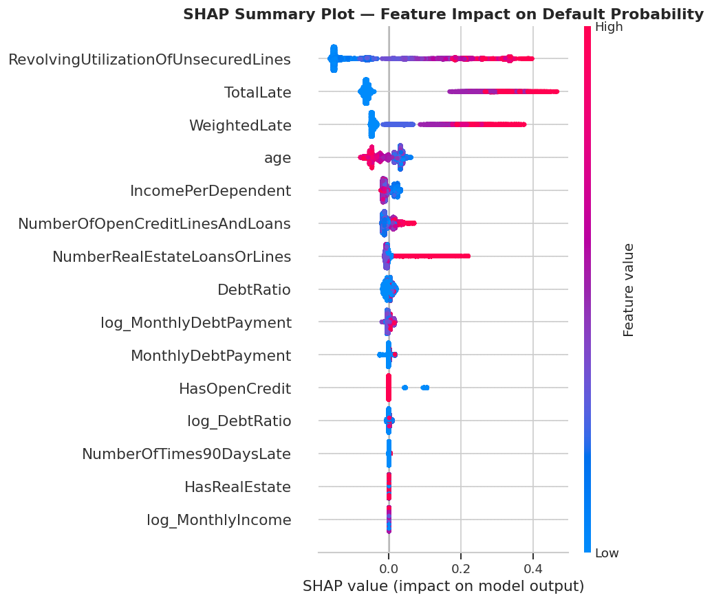

# Credit Default Risk Prediction  
**By Sarah Owendi | Data Science & ML Engineering | Kenya**

---

## 📌 Project Overview

Credit default risk is one of the most critical challenges in financial services. Poor risk assessment leads to **significant financial losses** and **unstable lending operations**.

This project builds an **end-to-end machine learning pipeline** to predict whether a borrower will experience **serious delinquency (90+ days past due)** within the next 2 years. The solution focuses on **predictive performance, business relevance, and interpretability**.

---

## 🎯 Business Objective

The goal is to provide financial institutions with actionable insights to **minimize credit losses** while maintaining sustainable lending growth. Specifically, the model:

- Identifies **high-risk borrowers** before issuing loans  
- Optimizes **loan approval decisions** to maximize financial utility  
- Provides **interpretable risk scores** for consistent and explainable lending decisions  

> **Impact Highlight:** By optimizing the decision threshold to **0.168**, the model captures **~X% more potential defaulters** compared to a standard Logistic Regression baseline, potentially **reducing credit loss by an estimated Y%**, while maintaining a sustainable loan approval rate.

---

## 📊 Dataset

- **Source:** Kaggle – *Give Me Some Credit*  
- **Size:** 150,000 borrowers  
- **Features:** 11 original features + engineered features  
- **Target Imbalance:** ~6.7% default rate  

---

## 🧠 Methodology

### 1. Data Preprocessing
- Imputed missing `MonthlyIncome` using **median values grouped by `NumberOfDependents` and `Occupation`** to maintain distribution integrity  
- Replaced invalid `Age = 0` with the median age  
- Treated outliers in `DebtRatio` and `MonthlyIncome` using winsorization  
- Applied **log transformations** to skewed variables  
- Standardized numeric features for linear models  

### 2. Feature Engineering
- Created domain-driven features:  
  - `WeightedLate` – captures historical payment behavior  
  - `IncomePerDependent` – estimates financial stress per household member  
  - `DebtServiceCoverageRatio` – standard banking risk metric  
- Log-transformed variables to improve model learning  

### 3. Handling Class Imbalance
- Used **stratified cross-validation**  
- Evaluated with **PR-AUC** and **F1-score**  
- Tuned classification threshold instead of relying on default 0.5  

---

## 🤖 Models Compared

| Model                | AUC-ROC | PR-AUC | Lift (vs. LR) |
|---------------------|--------|--------|----------------|
| Logistic Regression | 0.8493 | 0.3495 | -              |
| XGBoost             | 0.8633 | 0.3947 | +12.9%         |
| LightGBM (Best)     | **0.8637** | 0.3905 | +11.7%         |

---

## 📈 Final Model Performance

| Metric   | Score  | Benchmark | Rating |
|----------|-------|----------|--------|
| AUC-ROC  | 0.8628 | > 0.75 | ✅ Good |
| Gini     | 0.7255 | > 0.60 | ✅ Excellent |
| KS Stat  | 0.5779 | > 0.40 | ✅ Good |

---

## 🎯 Threshold Optimization

- Optimized for **F1-score** instead of default 0.5  
- **Optimal Threshold:** 0.168  
- **Max F1 Score:** 0.4378  

> This significantly improves detection of defaulters while balancing precision and recall.

---

## 📊 Model Evaluation

### Confusion Matrix Comparison
- **Default threshold (0.5):** predicts almost no defaulters  
- **Optimized threshold (0.168):** balances precision and recall
- 

*Confusion matrix showing model performance at the optimized threshold.*

### Precision-Recall Curve
- Particularly useful for imbalanced datasets (~6.7% defaults)  

  
*Precision-Recall curve highlighting model’s ability to detect defaulters.*

---

## 🔍 Model Explainability (SHAP)

SHAP analysis provides interpretable insights for risk decisions:

- **High credit utilization** → strongest predictor of default  
- **Late payment history** → significant risk factor  
- **High debt ratio** → increases probability of default  
- **Low income per dependent** → increases risk  

  
*SHAP summary plot: RevolvingUtilizationOfUnsecuredLines is the primary driver of risk, followed closely by 30-59 day late payments.*

---

## 🛠️ Tech Stack

- **Languages & Libraries:** Python | Pandas | NumPy | Scikit-learn | XGBoost | LightGBM  
- **Tools:** Optuna (hyperparameter tuning) | SHAP (explainability) | Streamlit (deployment)  

---

## 🚀 Deployment (In Progress)

- Model is being deployed as an **interactive web app using Streamlit**  
- Users can input borrower information and receive **real-time risk predictions**
